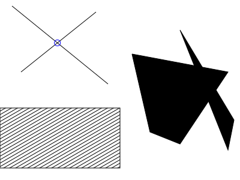
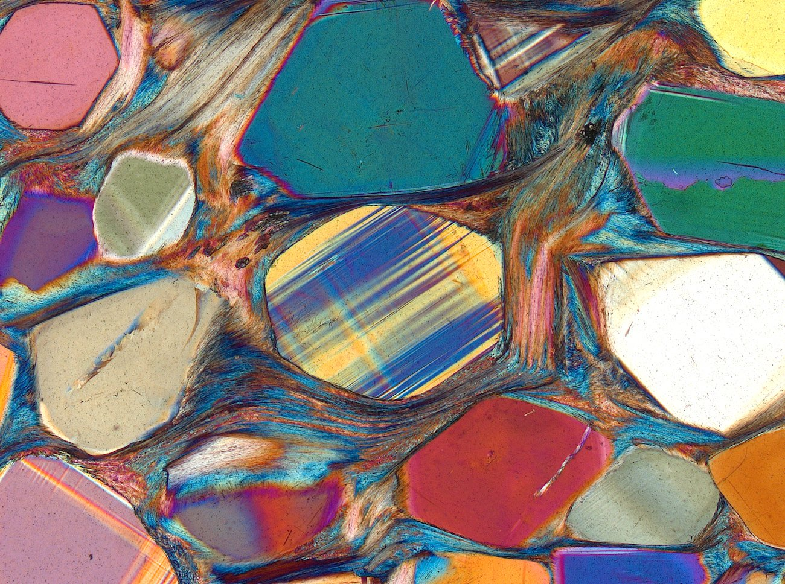

name: none
layout: true

---

name: normal
layout: true
class: left, middle

.footnote[[https://fitzgen.github.io/rust-conf-2019](https://fitzgen.github.io/rust-conf-2019)]

---

# .purple[<big>Flatulence, <br/> Crystals, <br/> and Happy Little Accidents</big>]

### .green[Nick Fitzgerald] <br/> [@fitzgen](https://twitter.com/fitzgen)

???

* hi
* thanks for coming to my talk about algorithmic art and Rust
* back up first and give you some context to my story

---

class: middle, center


???

* I do Rust things for work
    * these days on the intersection of Rust and WebAssembly
    * make fast things
    * make robust/reliable things
* create tools with good developer experiences, supporting many use cases
    * tools to help others build fast, robust, reliable things
* and I love my job!
    * but sometimes it can feel like a lot of Serious Business
* in my spare time, also writing little crates and side projects in Rust for fun
    * but these side projects had a tendency to become a part of my work
* realized that I was actually just working all the time
* not a recipe for a well-rounded life

---

class: center, middle


.headnote[Source: <a href="https://commons.wikimedia.org/wiki/File:Black_and_white_pottery_(Unsplash).jpg)">Wikimedia</a>]

???

* took up pottery as a hobby
* shaping the clay with my hands appealed to me
* I wanted a hobby that couldn't turn into work
    * something that doesn't have stakeholders
    * something that is just for me
    * something that I can relax and have fun doing

---

class: center, middle


.headnote[Source: [instagram.com/bluepotter](https://www.instagram.com/p/BPJEw4nhqfU/)]

???

* what I really liked about pottery:
    * every facet of it has so much depth you could spend a lifetime exploring it
        * if you love throwing on the wheel, you can perfect throwing long,
          skinny, fragile vases
        * or you can make your own glazes from scratch, like what was done with
          this image

---

# TODO: image of my metallic green bowl

???

* with glaze in particular, the whole felt greater than the parts
    * there is an element of surprise
        * because glaze is often dull and chalky before you fire it
        * comes out glassy and colorful
    * you can combine glazes by mixing or layering
        * I discovered that if I put a coat of black on top of green, then
          * I got something that came out metallic and shimmery
          * almost like an oil slick
          * neither glaze alone had this property, but combine them and
            something new/surprising _emerges_
          * I tried to recreate this effect with five bowls
          * only a single bowl made it through the process
* pottery is very difficult and requires lots of patience
    * things can irreparably break at every step of the whole process
    * there is no undo or version control
    * this difficulty is part of the craft and what makes it so impressive!
* personal realization:
    * despite all these things about pottery that I really enjoyed,
    * I was getting more frustrated by pottery's difficulty than I was relaxing
      and having fun, which were my original goals

---

class: center, middle


.headnote[Source: [*Process 13 (A)* by Casey Reas, 2010](http://reas.com/p13_s/)]

???

* heard of "generative art" and "algorithmic art"
* where people would write programs that generate images, animations, or music
* the same way I enjoyed discovering how glazes could combine such that their
  sum was greater than the individual glazes,
* generative artists are often searching to program simple rules that combine to
  create emergent behavior that is more bigger than any single rule
    * for example, this is *Process 13 (A)* by Casey Reas
        * circles moving behind the scenes
          * but they're not drawn directly
        * whenever circles are touching, draw a line between their centers
    * there is no code that says "draw these trellises"
        * they emerge from the process to surprise and delight us
* however, while I appreciated this art when I saw it, I wasn't ever overcome by
  the urge to produce it myself
    * there was still something missing:
    * nothing to hold onto; nothing physical

---

<video autoplay loop class="centermiddle" alt="The AxiDraw pen plotter drawing the Rust logo">
  <source src="images/axidraw-rust-5x-transposed.webm"/>
  <p>Video not supported.</p>
</video>

???

* and then I discovered pen plotters
* a pen plotter is a robot
    * you put a pen in its hand
    * and then you tell it to draw something
    * and this is the important part: and then it actually draws it!
    * now you have a physical, pen and paper artifact of your algorithm!!

---

.headnote[Source: [*Entropy Variation* by Paul Rickards, 2019](https://twitter.com/paulrickards/status/1133489029515751425)]


???

* in addition to creating an artifact you can frame and give to someone, the
  physical leaves more room for _emergence_:
    * a pen doesn't draw perfect Euclidean lines with zero area
    * different pens draw different lines
        * color
        * width
        * ballpoint pens vs fountain pens vs markers vs gel pens
    * ink bleeds
        * move the pen slower -> more bleeding
    * colors combine
        * draw a blue line on top of a yellow one -> get a shade of green that
          you don't even have a marker for
    * I think this piece by Paul Rickards takes advantage of the medium superbly
        * the way that the rectangles overlap and the colors combine suggests a
          transparency that isn't really there, and it gives the image depth
* _this_ is what I was missing from generative art
    * I'm hooked
* I made my decision:
    * I want to make algorithmic art
    * and I'm going to bring it into the physical world with a pen plotter

---

class: middle,center

# .yellow[How do I use a pen plotter?]

???

* at this point I have a lot more excitement than knowledge
* how do I get my new pen plotter to draw something?

---


.headnote[Source: [Wikipedia](https://en.wikipedia.org/wiki/Scalable_Vector_Graphics#/media/File:Bitmap_VS_SVG.svg)]

???

* the easiest way is to use SVG
* SVG stands for Scalable Vector Graphics
* "Vector" means that instead of talking about pixels, like jpeg and PNG do, we
  have shapes and paths
* the shapes and paths are described within some abstract coordinate space
* and the pen plotter can _scale_ the SVG's coordinate space up or down to the
  size of the paper that it's drawing on
    * and draw these shapes and paths with the pen you give
* How many of you know HTML or XML?
    * raise your hands -- great!
    * just like HTML and XML, SVG is a text format with a bunch of elements in
      pointy brackets
    * So everyone who just raised their hand is ready to be a plotter artist :)

---

```
use svg::node::element;

let data = element::path::Data::new()
    .move_to((10, 10))
    .line_to((60, 20))
    .line_to((25, 60))
    .close();

let path = element::Path::new()
    .set("fill", "none")
    .set("stroke", "blue")
    .set("stroke-width", 3)
    .set("d", data);

let document = svg::Document::new()
    .set("viewBox", (0, 0, 70, 70))
    .add(path);

svg::save("triangle.svg", &document)?;
```

.headnote[[crates.io/crates/svg](https://crates.io/crates/svg)]

???

* but I don't want to plot any old SVG
    * I want to programmatically generate my own SVGs from Rust
* the `svg` crate gives us a nice builder-style API for creating SVGs
    * and we can get surprisingly far using just this crate
* this example draws a triangle
    * the _path data_ describes a sequence of strokes in the coordinate space
    * the _path element_ describes the styles of how the strokes should be drawn
    * finally, the _document_ is the whole SVG image and its view box

---


.headnote[[github.com/nornagon/saxi](https://github.com/nornagon/saxi)]

???

* to get an SVG to the AxiDraw, which is the pen plotter that I have, use `saxi`
    * nice Web frontend to control the plotter
    * makes calibrating the pen's up and down height and centering on the page easy
    * can't recommend it highly enough

---

<pre><code class="svg">&lt;svg viewBox="0 0 70 70"
     xmlns="http://www.w3.org/2000/svg">
  &lt;path d="M10,10 L60,20 L25,60 z"
        fill="none"
        stroke="blue"
        stroke-width="3"/>
&lt;/svg>
</code></pre>

<div class="hbox">
  
  <span class="flex-1">TODO: plot triangle.svg</div>
</div>

???

* ok here is the result!
* on the top, we have the generated SVG source text for `triangle.svg`
    * as you can see it has a proper amount of pointy brackets
* on the bottom left, we have a software rendering of `triangle.svg`
* and on the bottom right, we have a photograph of `triangle.svg` drawn by a pen
  plotter with a TODO pen/marker
* when we generated the SVG, we said that the stroke lines would be fairly thick
  and blue
    * but as you can see, the pen plotter doesn't care what we said
    * it just moves its pen according to the paths

---

```
trait Rectangle {
    fn draw(
        &mut self,
        rng: &mut impl Rng,
        x: f64,
        y: f64,
        width: f64,
        height: f64,
        value: f64,
    ) -> element::path::Data;
}
```

???

* now that I could generate SVGs and plot them, I set an exercise for myself
* how many ways could I fill a rectangle?
* parameterized by a "darkness" value
    * where 0 ~= empty
    * and 1 ~= completely filled

---


???

* This is *Rectangle 2* with values 0.1, 0.5, and 0.9
* To create rectangle 2:
    * choose a random point within the rectangle
    * draw boxes out from that point with uniform distances between them until
      they fill the whole rectangle
    * lower value -> fewer boxes
    * higher value -> more boxes

---


???

* *Rectangle 6* is similar to rectangle 2
* except we always start in the middle
* and boxes that are closer to the middle have corners that are more rounded
  than the corners of boxes further from the middle

---


???

* *Rectangle 8* chooses points some distance along each of the outer rectangle's
  edges, and then draws lines between those points to create a new rectangle
* and it continues recursively

---

```
trait Tiling {
    fn new(
        rng: &mut impl Rng,
        columns: usize,
        rows: usize,
    ) -> Self;

    fn get_value(
        &mut self,
        rng: &mut impl Rng,
        x: usize,
        y: usize,
    ) -> f64;
}
```

???

* next, I explored ways to compose these rectangles by tiling them and varying
  the fill value across the individual rectangles within the tiling

---


<!--  -->

???

* this is *Tiling 0* of *Rectangle 10*
* the fill value is assigned according to the rectangle's row within the tiling
  * the first row has a fill value of zero
  * the second row has slightly higher fill value than the first
  * and so on, creating a vertical gradient effect

---


<!--  -->

???

* this is *Tiling 3* of *Rectangle 2*
* _Tiling 3_ assigns darkness based on how close a rectangle is to the center of
  the tiling
* but then introduces a little bit of random noise to perturb the results
* what I like about the piece
    * the kaleidoscope effect
    * almost looks like stained glass or maybe water ripples
    * this is another example of an _emergent property_
        * the effect is created by the way one rectangle's interior boxes happen
          to stack together next to another rectangle's interior boxes

---

# TODO: photo of tiling-3-rectangle-2 plotted

???

* This was my favorite of the tiling exercise; so I decided to plot it
* another surprise: lines thicker -> much darker than anticipated
* more ghostly

---

# .green[Constraint Breeds Creativity]

### 1. How many ways can I \_\_\_\_\_\_\_\_\_\_\_\_?

### 2. How many ways can I combine those?

???

* The hardest part is looking at a blank canvas and deciding what to do
    * side step it by giving yourself constraints and an exercise
    * and do as many things as you can within those constraints
    * maybe even just sit down and write a list of all the things that might fit
      those constraints first
    * and then start coding them afterwards
    * how many ways can I...
        * fill a rectangle?
        * draw a custom brush stroke along a given path?
        * visualize Perlin noise?
        * create some kind of random walker?
    * once you have a bunch of methods for drawing within those constraints, how
      many ways can you combine them?
        * How can I tile these rectangles and their fill values?
        * Can I construct interesting paths to draw based points where my random
          walkers overlap each other?
        * Can I define one of my brush stroke's lines in terms of another of my
          brush strokes?

---

# .blue[Simple Combinations<br/>of Simple Primitives]

### We don't need a framework to start making plotter art

???

* It doesn't take much to start making plotter art
* You don't have to learn a framework like Processing or Open Frameworks or Nannou
* You can start *now*!
* I did these first pieces with just the `svg` crate
    * but we don't even need that
    * could just as easily concatenate strings of SVG fragments together!
* I mention this because learning new frameworks can be intimidating/frustrating/slow
    * and the best way to start making art is to hit the ground running
    * once you have a problem that a framework is solving, *then* reach for the framework

---



???

* as we saw with our first triangle svg, pen plotters don't support all the
  features that software SVG renderers do
* for example, software renderers will fill in shapes with colors or gradients
    * if you want the plotter to fill a shape, you need to create a cross-hatch
      pattern, or some other set of paths for it to draw that will fill the
      shape
* software
* once you start running into these problems, it is a good time to consider
  reaching for a library or framework

---

# “fitzgen's art”

---

# “.green[f].opacity-half[itzgen's] .green[art]” ➟ “.green[fart]”

---

# TODO: Crystals

---


.headnote[Source: [*Aspirin Crystals* by Carol Roullard](https://mobile.twitter.com/CRoullardArt/status/1104782729017585664)]

???

* TODO

---



.headnote[Source: [*Charoite* by @micROCKScopica](https://mobile.twitter.com/micROCKScopica/status/1142428535036006401)]

???

* TODO

---

# TODO: feedback loop

---

# .green[Learn More]

#### Follow

* [#plottertwitter](https://twitter.com/hashtag/plottertwitter)

#### Watch

* [*Early Plotter Art, 1960s&mdash;1970s*](https://www.youtube.com/watch?v=OR_TzMFhv50) by Sher Minn Chong ([slides](http://piratefsh.github.io/presentations/plotter-history/))
* [*A Box of Chaos: The Generative Artist's Toolkit*](https://www.youtube.com/watch?v=kZNTozzsNqk) by Benjamin Kovach

#### Read

* [*Computational Drawing*](http://lostritto.com/book) by Carl Lostritto
* [*Computational Geometry in C*](http://cs.smith.edu/~jorourke/books/compgeom.html) by Joseph O'Rourke
* [*Executing Generative Art with a Plotter*](https://tylerxhobbs.com/essays/2018/executing-generative-art-with-a-plotter) by Tyler Hobbs
* [*On Generative Algorithms*](https://inconvergent.net/generative) by Anders Hoff
* [*The Nature of Code*](https://natureofcode.com/) by Daniel Shiffman

???

* here are a few resources that I've found helpful while learning about
  generative art and pen plotters
* I know I'm missing a bunch of things here
    * it wouldn't be possible to fit everything on one slide,
    * but also unfortunately I wasn't taking notes the whole time

---

# .purple[<big><big><big><big>Thank You!!</big></big></big></big>]

### .green[Nick Fitzgerald] <br/> [@fitzgen](https://twitter.com/fitzgen)
