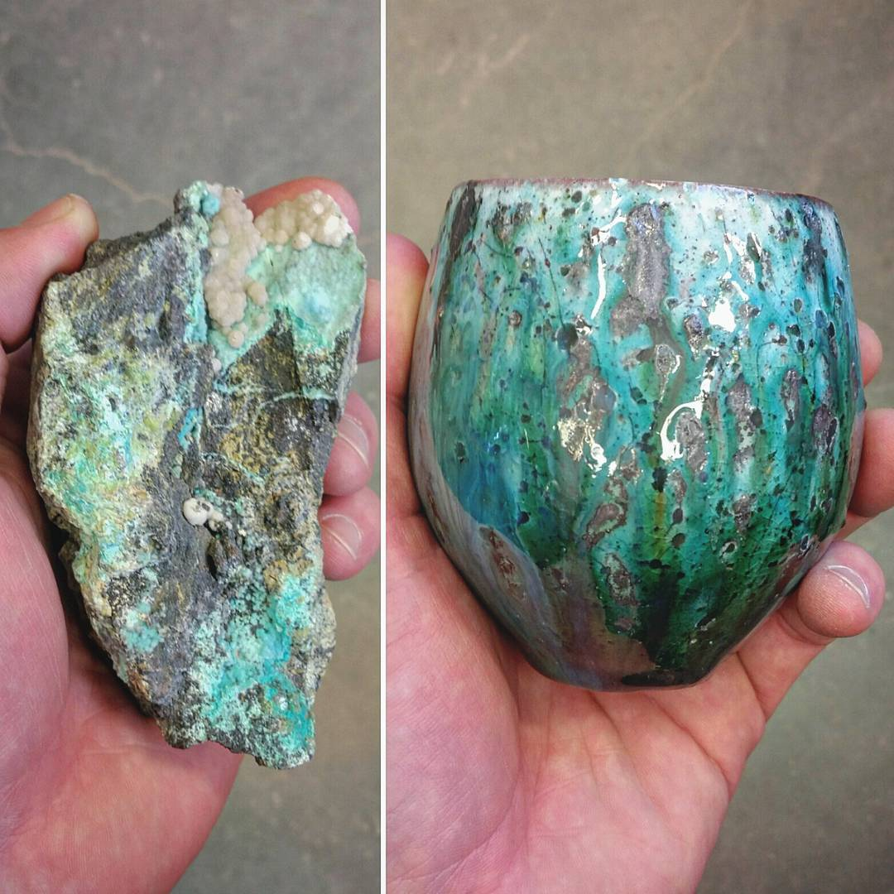
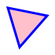
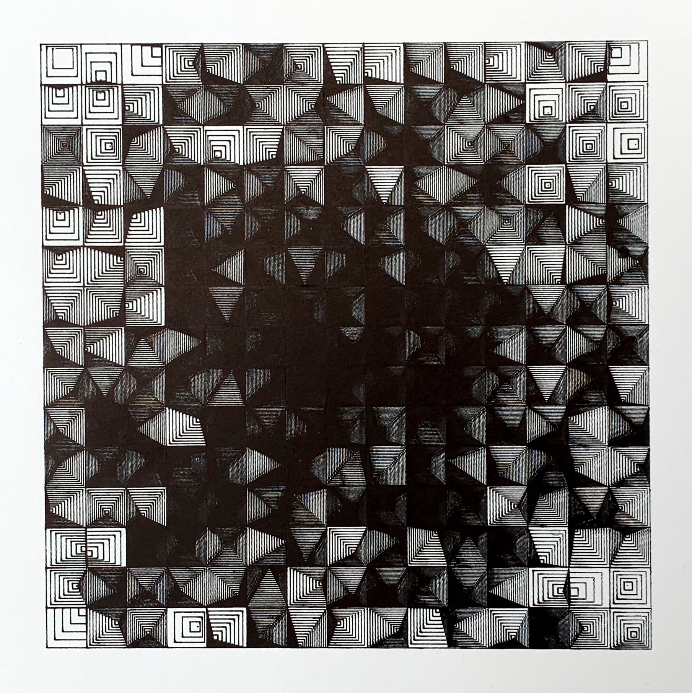
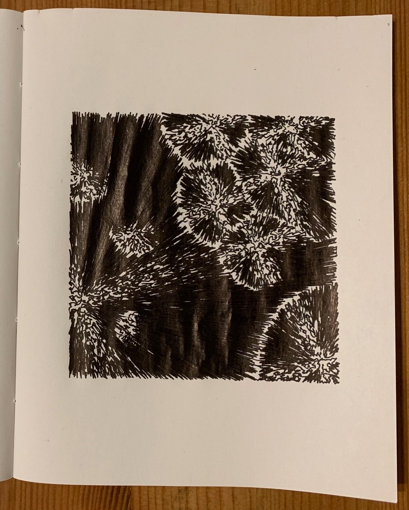
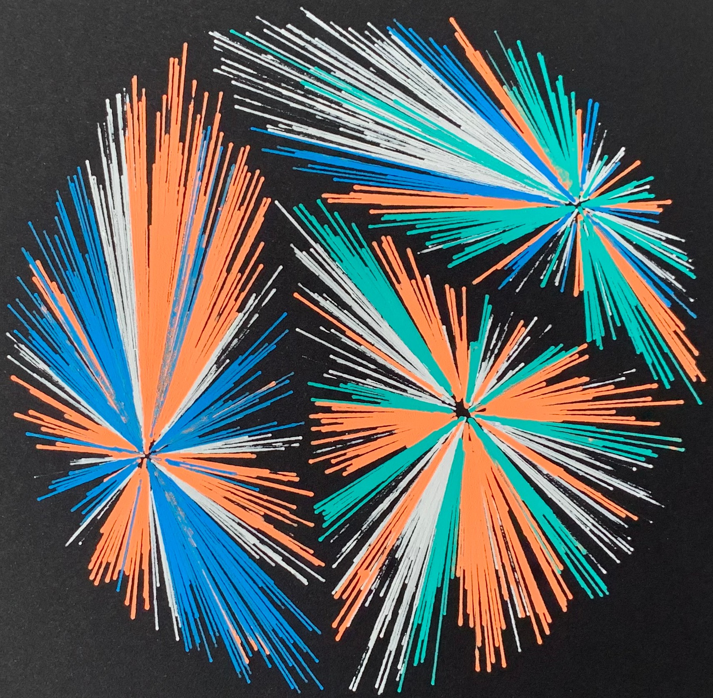
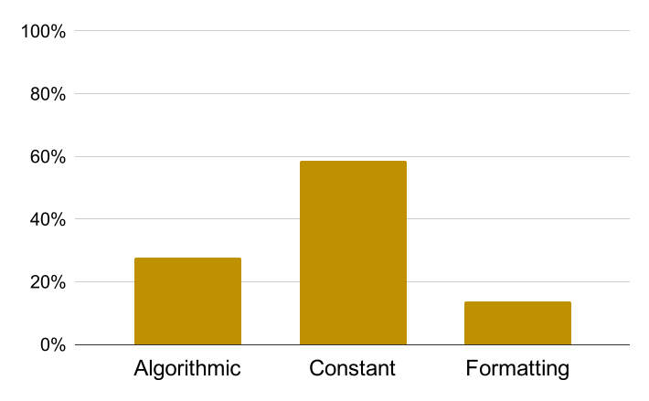

name: none
layout: true

---

name: normal
layout: true
class: left, middle

.footnote[[fitzgen.github.io/rust-conf-2019](https://fitzgen.github.io/rust-conf-2019)]

---

# .purple[<big>Flatulence, <br/> Crystals, <br/> and Happy Little Accidents</big>]

### .green[Nick Fitzgerald] <br/> [@fitzgen](https://twitter.com/fitzgen)

???

* hi, I'm Nick Fitzgerald
* thanks for coming to my talk about algorithmic art and Rust
* before art+Rust, share journey of how got here

---


???

* I do Rust things for work
    * intersection of Rust and WebAssembly
    * make fast things
    * make robust/reliable things
* create tools
    * w/ good developer experiences
    * supporting many use cases
    * help others build fast/robust/reliable things
* I love my job!
    * Serious Business
* in my spare time?
    * side projects in Rust for fun
    * but: semi related to work --> become part of work
* realized: just working all the time
* not a recipe for a well-rounded life

---


.headnote[Source: <a href="https://commons.wikimedia.org/wiki/File:Black_and_white_pottery_(Unsplash).jpg)">Wikimedia</a>]

???

* took up pottery as a hobby
* shaping clay w/ my hands was appealing
* I wanted a hobby that couldn't turn into work
    * no stakeholders
    * just for me
    * relax and have fun

---



.headnote[Source: [Matt Fiske Ceramics](https://www.instagram.com/p/BPJEw4nhqfU/)]

???

* every facet has so much depth
    * love throwing? --> long/skinny/fragile vases
    * or make glaze from scratch, like this image

---

# TODO: image of my metallic green bowl

???

* glaze: whole > parts
    * element of surprise
        * before firing: dull/chalky
        * after: glassy and colorful
    * combine glazes: mixing / layering
        * discovered: black on top of green, then
          * metallic and shimmery; oil slick
          * neither glaze alone had property
          * combine --> something new/surprising _emerges_
          * tried: recreate w/ five bowls
          * only one survived
* b/c pottery is difficult / requires patience
    * can break at every step
    * no undo / version control
    * part of craft: impressive!
* personal realization:
    * despite things about pottery that I enjoyed,
    * more frustrated by difficulty than relaxing / having fun

---


.headnote[Source: [*Process 13 (A)* by Casey Reas, 2010](http://reas.com/p13_s/)]

???

* "generative/algorithmic art" = write programs to generate images/animations/music
* recognized similarity w/ surprise of combining glazes:
    * generative artists programming simple rules --> emergent behavior, bigger
      than any single rule
        * *Process 13 (A)* by Casey Reas
            * circles moving behind scenes
              * not drawn directly
            * circles touching --> draw a line
        * no code says "draw trellises"
            * emerge from process to surprise / delight us
* however: nothing physical

---

<video autoplay loop class="centermiddle" alt="The AxiDraw pen plotter drawing the Rust logo">
  <source src="images/axidraw-rust-5x-transposed.webm"/>
  <p>Video not supported.</p>
</video>

???

* discovery: pen plotters
* pen plotter = robot
    * you put a pen in its hand
    * and then you tell it to draw something
    * and then -- important part -- draws it!
* now you have: physical, pen and paper artifact of generative algorithm!!

---

.headnote[Source: [*Entropy Variation* by Paul Rickards, 2019](https://twitter.com/paulrickards/status/1133489029515751425)]

<div class="hbox">
  
  <div class="vbox flex-1">
    
    
  </div>
</div>

???

* physical medium = more variables / emergence:
    * pen can't draw Euclidean lines w/ zero area
    * different pens
        * width
        * color
        * ballpoint vs fountain vs markers vs gel
    * ink bleeds
        * move the pen slower --> more bleeding
    * colors combine
        * blue on yellow --> unique green
    * this piece by Paul Rickards
        * takes advantage of medium superbly
        * rectangles overlap / colors combine --> transparency / depth
* _this_ = what was missing
* decision:
    * make algorithmic art
    * bring into physical world w/ pen plotter
* bought AxiDraw

---

class: middle, center

# .yellow[How do I use a pen plotter?]

???

* more excitement than knowledge
* how to draw something?

---


.headnote[Source: [Wikipedia](https://en.wikipedia.org/wiki/Scalable_Vector_Graphics#/media/File:Bitmap_VS_SVG.svg)]

```svg
<svg viewBox="0 0 70 70"
     xmlns="http://www.w3.org/2000/svg">
  <path d="M10,10 L60,20 L25,60 z"
        fill="pink"
        stroke="blue"
        stroke-width="3"/>
</svg>
```


???

* easiest way = SVG
    * <u>S</u>calable <u>V</u>ector <u>G</u>raphics
* no pixels; shapes and paths
* shapes/paths described w/in abstract coordinate space
* pen plotter _scales_ coordinate space up / down --> size of paper
    * draws scaled shapes/paths/lines
* ask: know HTML / XML?
    * raise hands -- awesome!
    * like HTML / XML: SVG is text with pointy brackets
    * everyone who raised hand = on the way to being a plotter artist :)

---

```
use svg::node::element;

let data = element::path::Data::new()
    .move_to((10, 10))
    .line_to((60, 20))
    .line_to((25, 60))
    .close();

let path = element::Path::new()
    .set("fill", "pink")
    .set("stroke", "blue")
    .set("stroke-width", 3)
    .set("d", data);

let document = svg::Document::new()
    .set("viewBox", (0, 0, 70, 70))
    .add(path);

svg::save("triangle.svg", &document)?;
```

.headnote[[crates.io/crates/svg](https://crates.io/crates/svg)]

???

* don't want: plot existing SVG
    * want: generate my own SVGs w/ Rust!
    * this code generated SVG on prev slide
* `svg` crate:
    * builder-style API
    * can get surprisingly far w/ just this crate
* this example = triangle
    * _data_ = sequence of strokes in coordinate space
        * ultimately controls pen movement
    * _path element_ = styles for strokes
    * _document_ = whole SVG image and box in coordinate space to render

---


.headnote[[github.com/nornagon/saxi](https://github.com/nornagon/saxi)]

???

* send SVG --> AxiDraw? use `saxi`
    * nice Web frontend
    * calibrating pen's up / down height; centering
    * can't recommend it highly enough

---

<div class="hbox">
  
  <span class="flex-1">TODO: plot triangle.svg</span>
</div>

???

* here is result!
* left:
    * software rendering of `triangle.svg`
* right:
    * photograph of `triangle.svg` drawn by pen plotter w/ TODO pen/marker
* we said "thick, blue lines + fill pink"
    * software renderer drew them
    * pen plotter can't
        * just moves pen along paths

---

```
trait Rectangle {
    fn draw(
        &mut self,
        rng: &mut impl Rng,
        x: f64,
        y: f64,
        width: f64,
        height: f64,
        value: f64,
    ) -> element::path::Data;
}
```

???

* now can generate / plot SVGs --> exercise for myself
* how many ways can I fill a rectangle?
    * parameterized by a "darkness" value
        * where 0 ~= empty
        * and 1 ~= completely filled
* how many impls of this trait?
    * take look at few results

---


???

* *Rectangle 8*
* darkness values = 0.1, 0.5, 0.9
* algorithm:
    * moves distance d along rectangle's outer edges
    * draw lines between points --> creates new quadrilateral
    * continue recursively

---


???

* *Rectangle 2*
* algorithm:
    * choose random point in rectangle
    * draw boxes out from that point, at uniform distances, until rectangle filled
    * lower darkness value --> fewer boxes
    * higher darkness value --> more boxes

---

exclude: true


???

* *Rectangle 6*
    * similar to rectangle 2, except start in middle
* boxes closer to the middle = more rounded
* boxes further from middle = less rounded

---

```
trait Tiling {
    fn new(
        rng: &mut impl Rng,
        columns: usize,
        rows: usize,
    ) -> Self;

    fn get_value(
        &mut self,
        rng: &mut impl Rng,
        x: usize,
        y: usize,
    ) -> f64;
}
```

???

* have many rectangles --> compose via tiling
    * vary darkness value for each rectangle

---


<!--  -->

???

* *Tiling 0* of *Rectangle 10*
* darkness value = row height
    * first row = 0
    * last row = 1
    * vertical gradient effect

---


<!--  -->

???

* *Tiling 3* of *Rectangle 2*
* darkness = how close to center of tiling?
    * w/ a little random noise
* I like:
    * kaleidoscope effect
    * stained glass
    * maybe water ripples
    * _emergent_

---



???

* favorite of tiling exercise --> decided to plot it
* another surprise:
    * lines thicker --> much darker than anticipated
* more ghostly

---

# .green[Constraint Breeds Creativity]

### 1. How many ways can I \_\_\_\_\_\_\_\_\_\_\_\_?

### 2. How many ways can I combine those?

???

* hardest part of starting = blank canvas
    * side step w/ constraints + exercise
* write list first, code after?
* how many ways can I...
    * fill rectangle?
    * draw custom brush stroke along given path?
    * visualize Perlin noise?
        * generates smooth gradients instead of pure random
    * different kinds of random walker?
        * move randomly thru coordinate space in interesting ways
* next: how many ways can I combine them?
    * tile rectangles + assign darkness values?
    * draw random walker's paths with custom brush strokes?

---

# .blue[Simple Combinations<br/>of Simple Primitives]

### We don't need a framework to start making plotter art

???

* doesn't take much to start making plotter art
    * don't have to learn framework
    * can start *now*!
* first pieces w/ just `svg` crate
    * SVG is pretty rich
* learning new frameworks can be intimidating
    * large API surface
    * sometimes best way to start = hit the ground running
* once you have a problem that a framework solves,
    * *then* reach for framework

---

<div class="vbox centermiddle" style="width: 65%">
  <div class="hbox flex-1">
    
    <div class="small-padding flex-1">TODO: plot triangle.svg</div>
  </div>
  <div class="hbox flex-1">
    
    <div class="small-padding flex-1">TODO: plot cross-hatch.svg</div>
  </div>
</div>

???

* as we saw w/ `triangle.svg`:
    * plotters don't support all SVG features that software renderers do
* software renderers:
    * fill in shapes with colors or gradients
* w/ plotter:
    * need to create cross-hatch pattern

---

<div class="vbox centermiddle" style="width: 65%">
  <div class="hbox flex-1">
    
    <div class="small-padding flex-1">TODO: plot bad-occlusion.svg</div>
  </div>
  <div class="hbox flex-1">
    
    <div class="small-padding flex-1">TODO: plot good-occlusion.svg</div>
  </div>
</div>

???

* software renderers draw elements in order
    * later elements can occlude earlier elements
    * w/ plotter:
        * draw first element
        * then draw second element,
        * result = elements drawn on top of each other
    * if want occlusion:
        * only generate paths that aren't covered
* running into these problems?
    * consider library / framework

---

# “fitzgen's art”

???

* or make your own personal framework!
    * started collecting my own crates for computational geometry and vector
      graphics
    * named it "fitzgen's art"
* too bloated
    * so to release some of the pressure...

---

# “.green[f].opacity-half[itzgen's] .green[art]” ➟ “.green[fart]”

???

* it became "fart"
    * hence the "flatulence" part of this talk's title
* promise: only fart joke in this talk
    *  nothing else is going to slip out

---


.headnote[Source: [*Aspirin Crystals* by Carol Roullard](https://mobile.twitter.com/CRoullardArt/status/1104782729017585664)]

???

* I follow people on twitter who do microscope photography
* this photo: Aspirin Crystals by Carol Roullard
    * outward growth until hits another crystal
        * forms zone
    * lines radiating out from center of each crystal
        * almost like exploding fireworks
        * colorful pinwheel effect
* _quite_ cool --> like to make plotter art reminiscent of this

---


.headnote[Source: [Wikipedia](https://en.wikipedia.org/wiki/File:Euclidean_Voronoi_diagram.svg)]

???

* this reminds me of *Voronoi diagrams:*
    * set of seed points
    * colors every point on plane by which seed each point is closest
* result = zones similar to our crystal photo

---


.headnote[Source: [Wikipedia](ohttps://en.wikipedia.org/wiki/File:Voronoi_growth_euclidean.gif)]

???

* makes sense:
    * can create Voronoi diagram w/ flood fill
    * intuitively similar to crystal growth

---

```
let seeds = random_points(N);
for _ in 0..M {
    let p = random_point();
    let c = find_closest(p, &seeds);
    draw_line(p, c);
}
```

???

* understanding of Voronoi diagrams --> create algorithm for crystal-inspired
  art
* choose `N` random points for seeds
* choose many `M` random points:
    * for each one
        * find closest seed
        * draw line to it
* lines create "exploding fireworks" aesthetic

---


???

* simple algorithm works pretty well!
    * here: plotted on black paper w/ white gel pen
    * can see resemblance to crystals
        * zones
        * fireworks
* difference from algorithm just presented:
    * lines only go part way to seed

---

<div class="hbox">
  
  
</div>

???

* played w/ giving seeds randomized "gravity" level
    * intention: variation in crystal sizes
    * happy little accident; more like comics explosion
* also, pinwheel effect:
    * via length of lines
    * based on angle of line to seed

---


???

* another variation:
    * only choosing points within a circle

---



???

* final variation
    *  uses colors for pinwheel effect

---

exclude: true


.headnote[Source: [*Charoite* by @micROCKScopica](https://mobile.twitter.com/micROCKScopica/status/1142428535036006401)]

???

* TODO

---

exclude: true


???

* TODO

---

class: middle, center

# .purple[Copy Something]

???

* "good artists copy; great artists steal"
    * since I'm new to this, I'll settle for "good"
* but I think the lesson here is to find inspiration in something and then try to copy it
    * this can actually be some plotter art made by someone else
        * maybe vintage plotter art from the 1960s
    * or it could be translating something that isn't related to computers at
      all into the plotter medium
        * for example, the pattern of cracks on the glaze of some piece of
          pottery
        * or plant, flower, and leaf growth patterns

---

# .yellow[Frustration:]
## My feedback loop is .blue[too slow]

???

* earlier, I presented the process as:
    * write a rust program
    * use it to generate an SVG
    * plot the SVG
* this was a simplified view, notably it doesn't take into account that we don't
  write perfect programs on the first try
      * sometimes people say of Rust or other languages with strong type
        systems: "if it compiles, then it works"
      * unfortunately this doesn't really apply, since I haven't found a way to
        encode my aesthetic taste into somthing that the borrow checker can
        enforce at compile time
* what's really happening is that there's a feedback loop where:
    * I look at the SVGs generated by my program
    * and then decide to tweak the program
    * and then I look at the new SVGs generated by my program
    * tweak the program again
    * etc... until I'm happy with the output and decide to plot it

---

## Edit <br/> Compile <br/> Run <br/> Alt-Tab to Firefox <br/> Refresh <br/> Alt-Tab back to Emacs <br/> Repeat

???

* feedback loop is too slow + involves manual work:
    * edit the sources
    * compile the program
    * if no compilation errors --> run the program
    * if runs OK --> alt-tab to Firefox
    * refresh to see the newest SVG
    * alt-tab back to Emacs
    * repeat

---

<cite><a href="https://www.kovach.me/posts/2018-10-13-infrastructure-of-art.html">Tips for Generative Infrastructure and Tooling</a> by Benjamin Kovach:</cite>

> ### Rendering new images on any source change
>
> When I make a change in a file, I expect to see the result of that change as
> soon as possible, without doing anything extra.

???

* luckily Benjamin Kovach wrote a great article on tooling and infrastructure
  for generative art, laying out how to solve this problem (and others)!
    * Use a file watcher --> automatically recompile and rerun on every change
    * if recompiles OK && generates SVG OK then
        * save image as `images/<timestamp>.svg`
        * symlink as `images/latest.svg`
        * make a git commit of everything: images and code
            * This way you never lose any image you ever generate and you also
              have the code that generated the image, if you want to go back and
              riff on a different theme from what you did the first time
* I thought these tips were really great
    * especially about saving all images you ever generate
    * and this did speed up my feedback loop a little bit
* _however:_ it didn't solve the problem. my feedback loop is _still_ too slow:
    * I'm not manually kicking off compiles and running the program
      anymore,
    * but I'm still
        * waiting on compiles,
        * alt-tab'ing to Firefox,
        * refreshing to see the latest SVG,
        * alt-tab'ing back to Emacs,
    * and it is frustrating because it seems like my changes are usually small
      things, like:
        * what if there were 9 rows and columns instead of 5?
        * what if gravity was half as strong?

---

class: center

## Types of Changes



???

* so I actually took a random sample of commits from one of my pieces and
  categorized their changes. they all fit into three categories:
    * "algorithmic" changes = things that actually change something about the
      algorithm of the code
    * "constant" changes = tweaking a constant value, e.g. changing the std
      dev. of some normal distribution I'm using
    * "formatting" changes = essentially I just ran `rustfmt`
* I'm spending most of my time waiting on compiles for tweaking *constants*?!
    * I already knew this deep down, but to having empirical evidence, it just
      blows my mind

---

```
fart::user_const! {
    const NUMBER_OF_PARTICLES: usize = 1234;
}
```

???

* so I invented this brand new thing which I call "user constants"
    * they let me tweak constant values in between runs of the program without
      recompiling it
    * you might know them by the name "environment variables"

---


???

* but "user constants" aren't _just_ environment variables
* there's also a local server that goes with them
    * the local server has a web UI with a form widget dynamically created for
      each user constant
        * these are over on the bottom left
    * tweak the constant --> POST request to the local server
    * which updates the environment variable
    * re-runs the program
    * and pushes the generated SVG back the web UI so the preview is refreshed
      automatically
* additionally, I'm running split screen with emacs so I don't need to do any
  alt-tab'ing anymore

---

## .green[Edit] <br/> .strike[Compile] <br/> .green[Run] <br/> .strike[Alt-Tab to Firefox] <br/> .strike[Refresh] <br/> .strike[Alt-Tab back to Emacs] <br/> .green[Repeat]

???

* now, for constant tweaking, which was ~60% of the changes that I make, the
  feedback loop's critical path is just edit the constant and look at the
  updated image in practice
    * the program does need to be re-run, but it happens automatically and I'm
      not waiting around for it to finish
    * the previous screenshot says it took just under 10 milliseconds to run the
      program and generate the SVG, which is barely perceptible
* with this setup, my feedback loop is finally near-instantaneous

---


???

* The result is I am able to explore more ideas faster than I previously could
* I'm making new pieces I'm increasingly happy with, such as this one
* and at the end of the day:
    * I have a hobby that isn't work
    * that I can do just for me,
    * I'm having fun making algorithmic art with Rust and then bringing it into
      the physical world with my pen plotter

---

# .green[Learn More]

#### Follow

* [#plottertwitter](https://twitter.com/hashtag/plottertwitter)

#### Watch

* [*Early Plotter Art, 1960s&mdash;1970s*](https://www.youtube.com/watch?v=OR_TzMFhv50) by Sher Minn Chong ([slides](http://piratefsh.github.io/presentations/plotter-history/))
* [*Process Compendium*](https://vimeo.com/22955812) by Casey Reas

#### Read

* [*Computational Drawing*](http://lostritto.com/book) by Carl Lostritto
* [*Computational Geometry in C*](http://cs.smith.edu/~jorourke/books/compgeom.html) by Joseph O'Rourke
* [*Executing Generative Art with a Plotter*](https://tylerxhobbs.com/essays/2018/executing-generative-art-with-a-plotter) by Tyler Hobbs
* [*On Generative Algorithms*](https://inconvergent.net/generative) by Anders Hoff
* [*The Nature of Code*](https://natureofcode.com/) by Daniel Shiffman

???

* here are a few resources that I've found helpful while learning about
  generative art and pen plotters
* I know I'm missing a bunch of things here
    * it wouldn't be possible to fit everything on one slide,
    * but also unfortunately I wasn't taking notes the whole time
* I hope my story has inspired some of you to try your hand at this stuff or
  maybe pottery
* I think a lot of the take aways are generally applicable even if you aren't
  doing art, but just professional programming:
    * define constraints to make a problem smaller and easier to solve
    * copy something to learn more about it, or to cross pollinate ideas from
      another field
    * analyze your feedback loop and iteration times, gather empirical evidence,
      treat it as a profiling and optimization problem and build custom tooling
      to boost your productivity

---

<h1 class="purple"><big><big><big><big>Thank You!!</big></big></big></big></h1>
<h3 class="green">Nick Fitzgerald <br/> <a href="https://twitter.com/fitzgen">@fitzgen</a></h3>
